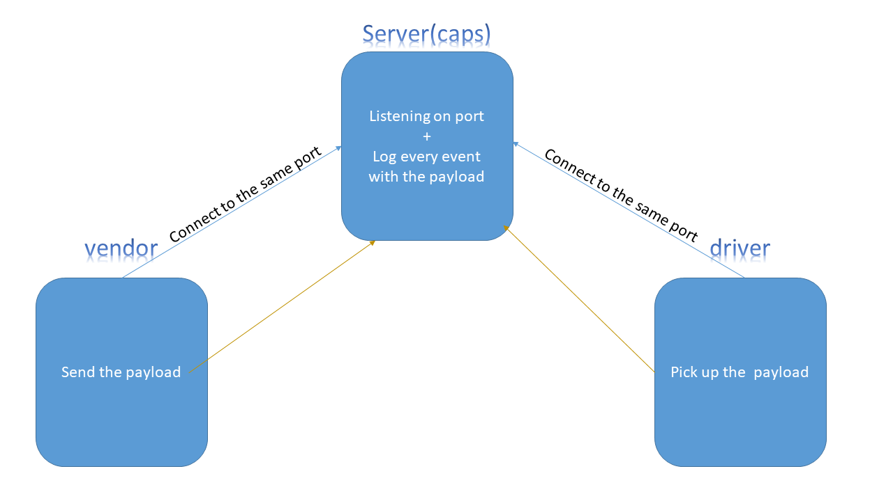

# caps
 in the CAPS system the Vendors and the Drivers will each be on different computers and can’t be using the same running application, so we’ll need a way to keep everything in sync over the network.

Before you begin
### Author: Yasmin Adaileh :sunglasses:

### Links and Resources :paperclip:

### Documentation
- [Submission PR](https://github.com/yasmin-401-advanced-javascript/caps/pull/1)

## Library Used

In this app I used only the **events**

### Modules
- `events.js` 
- `caps.js`
- `driver.js` 
- `vendor.js` 

### Packages
- `faker`
- `jest` 
- `uuid` 

## Instruction How to Install the Library

1. `npm i faker` run it in the command line(Ubuntu)
2. `npm i -D jest` run it in the command line(Ubuntu)
3. `npm i net` run it in the command line(Ubuntu)
4. `npm i uuid` run it in the command line(Ubuntu)

## How to run the app? :runner:

in the **Ubuntu** just type:
`nodemon` run it in the command line(Ubuntu)
`node caps.js`
`node vendor.js`
`node driver.js`

## UML

-------------------------------------------------------------------------